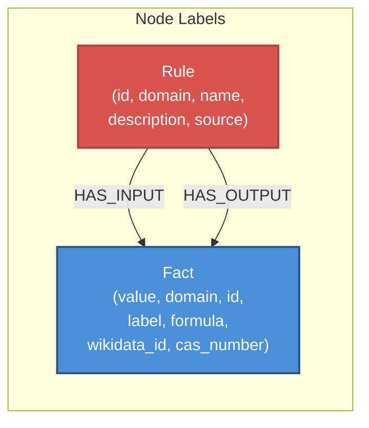

# Neo4j Graph Schema — Omni-IPS Knowledge Base

This document defines the precise Cypher schema used by the Omni-IPS Knowledge Graph stored in Neo4j. All ETL pipelines (`ingest_chemistry.py`, `ingest_geometry.py`) conform to this schema.

---

## Node Labels

### `:Fact`
Represents a single logical assertion, concept, or entity within a specific domain.

| Property       | Type       | Required | Description |
|:-------------- |:---------- |:-------- |:----------- |
| `value`        | `String`   | ✅       | Canonical string representation of the fact (e.g., `"H2O"`, `"Triangle(A,B,C)"`, `"x+2=5"`). **Part of the unique composite key.** |
| `domain`       | `String`   | ✅       | Logical domain name (`"chemistry"`, `"geometry"`, `"algebra"`). **Part of the unique composite key.** |
| `id`           | `String`   | ✅       | Unique identifier (e.g., `"wd_Q283"` for Wikidata water, `"geo_fact_0"`). |
| `label`        | `String`   | ❌       | Human-readable label (e.g., `"water"`, `"Triangle(A,B,C)"`). |
| `formula`      | `String`   | ❌       | Chemical formula (chemistry domain only). |
| `wikidata_id`  | `String`   | ❌       | Wikidata QID (chemistry domain only, e.g., `"Q283"`). |
| `cas_number`   | `String`   | ❌       | CAS Registry Number (chemistry domain only). |
| `created_at`   | `DateTime` | ❌       | Timestamp of initial creation in the graph. |

**Uniqueness Constraint:**
```cypher
CREATE CONSTRAINT fact_unique IF NOT EXISTS
FOR (f:Fact) REQUIRE (f.value, f.domain) IS UNIQUE
```

---

### `:Rule`
Represents a production rule, chemical reaction, geometric theorem, or algebraic law.

| Property       | Type       | Required | Description |
|:-------------- |:---------- |:-------- |:----------- |
| `id`           | `String`   | ✅       | Unique rule identifier (e.g., `"rxn_synth_water"`, `"thm_pythagorean"`). **Part of the unique composite key.** |
| `domain`       | `String`   | ✅       | Logical domain name. **Part of the unique composite key.** |
| `name`         | `String`   | ✅       | Human-readable rule name (e.g., `"Synthesis of Water"`, `"Pythagorean Theorem"`). |
| `description`  | `String`   | ❌       | Detailed description for RAG/UX explanation generation. |
| `source`       | `String`   | ❌       | Authoritative citation (e.g., `"Zumdahl, Chemistry 10th Ed., Ch.4"`). |
| `created_at`   | `DateTime` | ❌       | Timestamp of initial creation in the graph. |

**Uniqueness Constraint:**
```cypher
CREATE CONSTRAINT rule_unique IF NOT EXISTS
FOR (r:Rule) REQUIRE (r.id, r.domain) IS UNIQUE
```

---

## Relationship Types

### `(:Rule)-[:HAS_INPUT]->(:Fact)`
Connects a Rule to each of its antecedent (precondition) Facts.

- **Direction:** Rule → Fact
- **Semantics:** "This rule requires this fact to be present in Working Memory before it can fire."
- **Chemistry interpretation:** Reactants of a reaction.
- **Geometry interpretation:** Hypotheses of a theorem.

### `(:Rule)-[:HAS_OUTPUT]->(:Fact)`
Connects a Rule to each of its consequent (conclusion) Facts.

- **Direction:** Rule → Fact
- **Semantics:** "When this rule fires, it produces/asserts this fact into Working Memory."
- **Chemistry interpretation:** Products of a reaction.
- **Geometry interpretation:** Conclusions of a theorem.

---

## Visual Schema Diagram



---

## Example Cypher Queries

### Insert a Fact and Rule with relationships
```cypher
-- Create a chemistry Fact
MERGE (f:Fact {value: "H2O", domain: "chemistry"})
ON CREATE SET f.id = "wd_Q283", f.label = "water", f.formula = "H2O"

-- Create a Rule
MERGE (r:Rule {id: "rxn_synth_water", domain: "chemistry"})
ON CREATE SET r.name = "Synthesis of Water", r.description = "2H₂ + O₂ → 2H₂O"

-- Create relationships
MATCH (r:Rule {id: "rxn_synth_water", domain: "chemistry"})
MATCH (f_h2:Fact {value: "H2", domain: "chemistry"})
MATCH (f_o2:Fact {value: "O2", domain: "chemistry"})
MATCH (f_h2o:Fact {value: "H2O", domain: "chemistry"})
MERGE (r)-[:HAS_INPUT]->(f_h2)
MERGE (r)-[:HAS_INPUT]->(f_o2)
MERGE (r)-[:HAS_OUTPUT]->(f_h2o)
```

### Query all reactions that produce a given compound
```cypher
MATCH (r:Rule)-[:HAS_OUTPUT]->(f:Fact {value: "NaCl", domain: "chemistry"})
RETURN r.name, r.description
```

### Find the proof chain for a geometry theorem
```cypher
MATCH path = (r:Rule {domain: "geometry"})-[:HAS_INPUT|HAS_OUTPUT]->(f:Fact)
WHERE r.name CONTAINS "Pythagorean"
RETURN path
```

### Count all nodes and relationships per domain
```cypher
MATCH (n)
WHERE n:Fact OR n:Rule
RETURN n.domain AS domain, labels(n)[0] AS label, count(n) AS count
ORDER BY domain, label
```

---

## Batched Ingestion Pattern

All ETL pipelines use the `UNWIND` + `MERGE` pattern for efficient bulk writes:

```cypher
UNWIND $batch AS row
MERGE (f:Fact {value: row.value, domain: row.domain})
ON CREATE SET f.id = row.id, f.label = row.label, f.created_at = datetime()
```

Default batch size: **100** (chemistry) / **50** (geometry).
